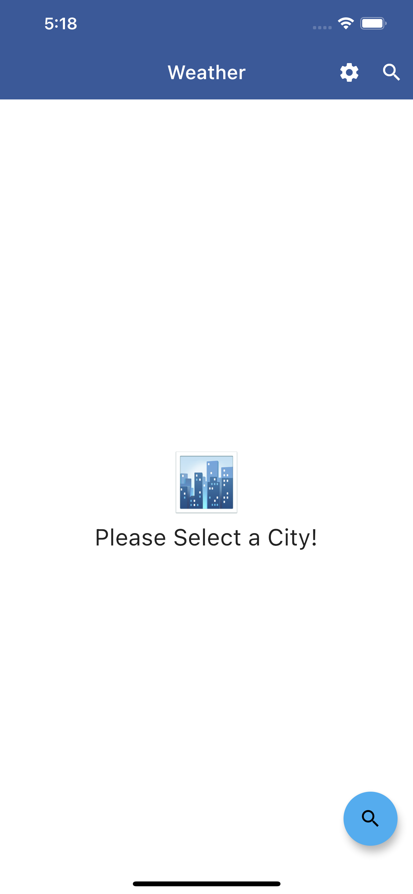
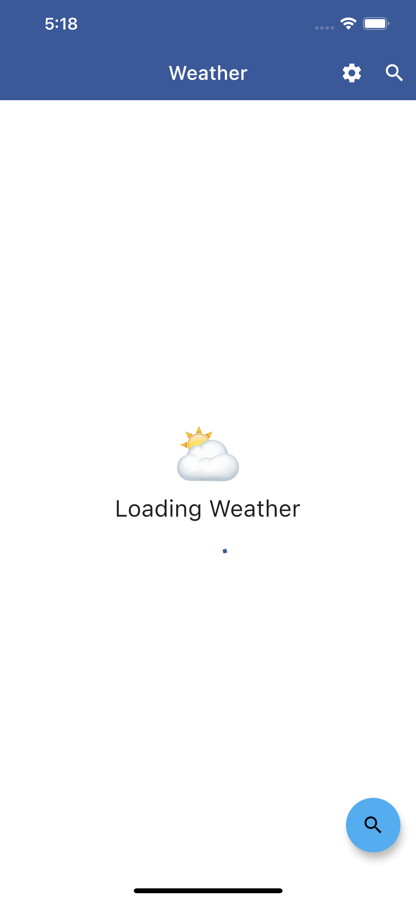
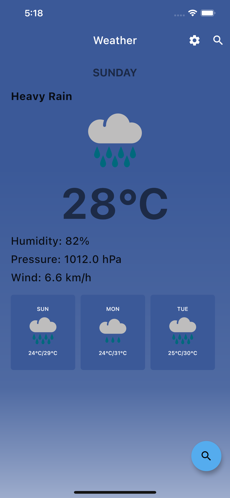

# 📈Weather App built with Riverpod

 

This is a weather app built using Riverpod as it's State Management. This project is an attempt to rewrite the Weather App sample at [Flutter Bloc Example](https://bloclibrary.dev/#/flutterweathertutorial) created by [Felix Angelov](https://github.com/felangel) in Riverpod.

The [Meta Weather API](https://www.metaweather.com) was used to provide the data.
This project was created for educational purposes only and it's not intended to be a reference point to get weather data.

## 💻 Requirements

* Any Operating System (i.e MacOS X, Linux, Windows)
* Any IDE with Flutter SDK installed (ie. IntelliJ, Android Studio, VSCode etc)
* A little knowledge of Dart and Flutter
* A brain to think 🤓🤓

## ✨ Features

* [x] See weather forecast for a location.
* [x] See next 5 days of forecast.
* [x] Change temperature.

## 📸 Screenshots

&nbsp;

&nbsp;

&nbsp;

## 🔌 Plugins

| Name | Usage |
|:------:|:-------:|
|[**riverpod**](https://pub.dev/packages/riverpod)| State Management|
|[**DIO**](https://pub.dev/packages/dio)| Network calls|
|[**FlexColorScheme**](https://pub.dev/packages/flex_color_scheme)| App Theming|
|[**Flutter Hooks**](https://pub.dev/packages/flutter_hooks)| A Flutter implementation of React hooks|

## 🤓 Author(s)

**Ajiboye Temitope Oluwatayomi** 

## 🔖 License

[Apache-2.0](https://github.com/tayormi/covid_tracker/blob/master/LICENSE)

***
> Feel free to star ⭐ this repository if you like what you see 😉.
